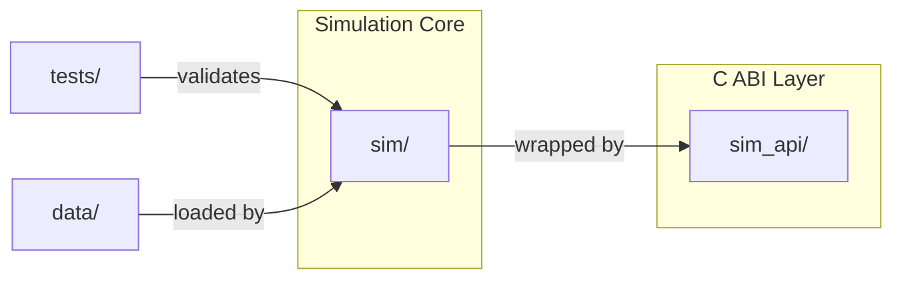

# ARPG Simulation Core

A deterministic, data-driven gameplay simulation core for ARPGs, written in modern C++23. The simulation runs as a DLL with a stable C ABI; the visualization layer (Unity) is a separate consumer and currently [**WIP**](https://github.com/fuchsteufelswild/arpg-simulation-core/tree/master/unity/arpg-sim-client).

## What this is

A clean implementation of the gameplay systems that define ARPGs like Path of Exile — modifier evaluation, ability composition, status effects, deterministic combat — separated cleanly from rendering and input. The C++ core knows nothing about Unity, OpenGL, or graphics. Unity reads sim state via snapshots and submits commands. The boundary is a five-function C ABI.

The project demonstrates production-grade C++ gameplay architecture: data-oriented design, clear ownership, deterministic update loops, layered systems, comprehensive testing.

## Architecture at a glance

- **Pure C++23 simulation library** (`sim/`) — world, entities, modifiers, abilities, status effects, the tick loop
- **C ABI shim** (`sim_api/`) — five exported functions, opaque handle, zero-copy snapshots, marshaled commands
- **Test suite** (`tests/`, `sim_api/tests/`) — 191 tests covering unit behavior and integration scenarios
- **Data-driven content** (`data/abilities.toml`) — abilities defined declaratively and loaded at startup

The C++ core is single-threaded by design — determinism is significantly cheaper to guarantee on a single thread, and the workload doesn't justify threading at this scale.

## Key features

### Modifier system

Modifiers compose to scale stats using the formula `base × (1 + Σ increased) × Π more`. Three operations stack predictably: `Flat` adds, `Increased` accumulates additively then multiplies once, `More` multiplies separately. Modifiers can be:

- **Tagged** (apply only to specific ability types)
- **Conditional** (apply only when predicates evaluate true: at full life, against chilled enemies, on crit, etc.)
- **Meta** (amplify other modifiers based on tag matching — implements PoE-style "your spell modifiers are 50% more effective")

Two-phase evaluation cleanly handles meta-modifiers without recursion.

### Ability system

Abilities compose effects using `std::variant`-dispatched effect types: `Damage`, `ApplyStatus`, `Chain`, `Trigger`. New effect kinds require ~40 lines and zero ability rewrites. The system handles:

- Cast time and cooldowns per ability per caster
- Projectile travel with deterministic position updates
- Chain effects with sim-owned spatial queries (deterministically tie-broken)
- Triggered abilities via deferred command queue (no re-entrancy hazards)
- RNG-driven critical hits with `OnCrit` and `CritRecently` conditions

### Determinism

Tier-1 deterministic: same seed plus same input log produces bit-identical state on the same machine and build. Achieved by:

- Explicit seeded RNG (SplitMix64), state is part of sim
- Integer tick counters, no float-time accumulation
- No iteration over unordered containers for sim-affecting decisions
- Deterministic tie-breaking in spatial queries
- All math through a `SimFloat` typedef (upgrade path to fixed-point for cross-platform determinism)

A replay harness records inputs to disk and reproduces final state hashes, giving testable evidence of determinism.

### Status effects

Four v1 statuses (Chill, Ignite, Poison, Stun) with three distinct stacking rules (replace-if-stronger, stacking, refresh). Statuses contribute tags to the target for conditional modifier matching, and DoTs queue damage commands during the standard update phase.

### Spatial queries

Sim-owned 2D grid with cell-bucketed entity storage, rebuilt each tick. Radius queries return deterministically-sorted candidate lists. Used for chain targeting; reusable for AoE and ability targeting in general.

## Building

### Requirements

- Windows with MSVC 2022 (17.8+) — `cl.exe` from x64 Native Tools Command Prompt
- CMake 3.28+
- Ninja
- vcpkg with `VCPKG_ROOT` environment variable set
- Dependencies installed via vcpkg manifest: Catch2, fmt, nlohmann-json, tomlplusplus

### Build

```cmd
cmake --preset debug
cmake --build --preset debug
ctest --preset debug
```

Outputs land in `build/debug/bin/`:
- `sim_api.dll` — the simulation DLL for Unity
- `sim_tests.exe`, `sim_api_tests.exe` — test executables

### Verify DLL exports

```cmd
dumpbin /exports build\debug\bin\sim_api.dll
```

You should see six unmangled exports: `sim_create`, `sim_destroy`, `sim_advance`, `sim_submit_commands`, `sim_get_snapshot`, `sim_get_cooldowns`, `sim_debug_spawn_entity`, `sim_version`.

## Project structure


**Notes**
- `sim/` — deterministic gameplay simulation library written in C++23
- `sim_api/` — stable C ABI DLL consumed by Unity
- `tests/` — tests for sim/ — link against sim directly, not via DLL
- `sim_api/tests` - tests for C ABI DLL
- `data/` — TOML gameplay content definitions
- `.clang-format` — auto-format style
- `.clang-tidy` — static analysis (curated checks for gameplay C++)
- `sim_api/.clang-tidy` — overrides for C ABI conventions
- `CMakePresets.json` — debug and release presets, Ninja generator, vcpkg


## Testing

Unit tests cover:
- World/entity lifecycle, generational handles
- Modifier formula correctness (flat/increased/more, conditional, meta)
- Ability resolution paths (instant, delayed, projectile, chain, trigger)
- Status stacking and DoT ticking
- Spatial query determinism
- Crit roll determinism
- Replay reproducibility

Run with `ctest --preset debug` or directly invoke the test executables.

## Design decisions worth flagging

- **No ECS framework.** Hybrid layout — flat parallel arrays for bulk-iterated components (transform, health), nested per-entity storage for structurally rich data (modifiers, statuses).
- **No virtual dispatch in the hot path.** Effects are `std::variant`; commands are tagged unions at the C boundary; switches over enum classes are exhaustive (no default case).
- **Smart pointers used sparingly.** Value types and generational handles cover almost everything. Raw pointers signal non-owning references.
- **Deferred command pattern throughout.** Phase 1 reads, phase 2 mutates. Triggers, damage application, kills, casts all queue rather than mutating mid-iteration.
- **Test-first when designs were tricky.** Modifier evaluation, status stacking rules, spatial query determinism, and replay reproducibility have explicit unit tests.

## Limitations and roadmap

The current scope is portfolio-quality but intentionally bounded due to time limitations. Known gaps and intended next steps:

- **Status modifiers via deferred commands.** Status effects currently contribute tags but do not contribute modifiers (e.g., Chill's movement speed reduction). Adding it requires a `ApplyModifierCommand` to maintain the read-only update phase.
- **Cached stat evaluation (v1.5 of modifier system).** Cache reserved fields on `StatBucket` exist but are unused. Caching unconditional stat evaluations would speed bulk damage calculations.
- **Tier-2 determinism.** Currently same-machine same-build deterministic. Cross-machine determinism requires fixed-point math throughout. The `SimFloat` typedef discipline is the seam for this upgrade.
- **Continuous integration.** GitHub Actions to build and test on push is a planned addition.

## License

The project is licensed under the MIT License.